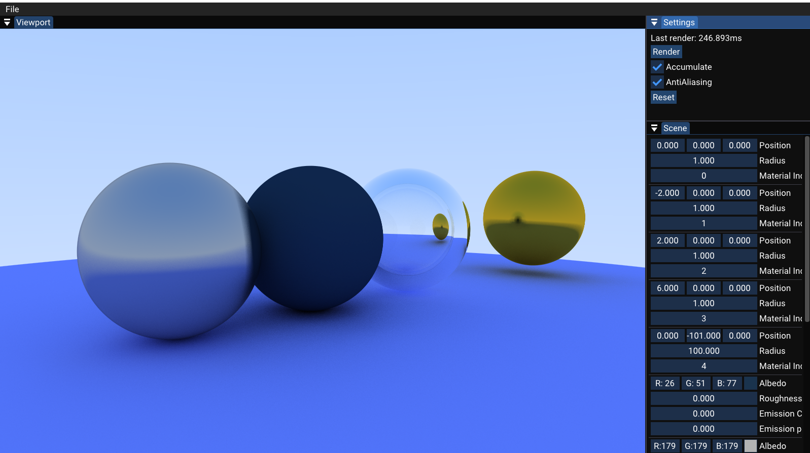

# RayTracing 

A simple "realtime" raytracer created for learning purposes.
Thus far it only supports multithreading on the CPU and utilizes no GPU shaders.

# Building and running 

Supports Windows and Visual Studio 2022. The [Vulkan SDK](https://vulkan.lunarg.com/sdk/home) has to be installed.

1. Clone recursively:  `git clone https://github.com/kw3ller/raytracer.git --recursive`
2. Run scripts/Setup.bat
3. Open RayTracing.sln and run in Release mode (Debug is very slow)

## Aknowledgements

Recources used: 
- [WalnutAppTemplate](https://github.com/StudioCherno/WalnutAppTemplate) by theCherno
- [Raytracing Youtube Series](https://www.youtube.com/watch?v=gfW1Fhd9u9Q&list=PLlrATfBNZ98edc5GshdBtREv5asFW3yXl) by TheCherno
- [Ray Tracing in One Weekend — The Book Series](https://raytracing.github.io/) by Peter Shirley

